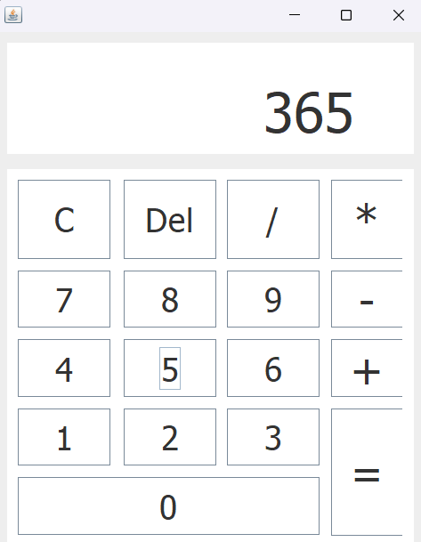

# Projeto: Calculadora em Java

## Descrição Geral
Neste projeto, criei uma calculadora utilizando Java com orientação a objetos e Swing para a interface gráfica. O resultado é uma calculadora responsiva que realiza todas as operações básicas de matemática.

## Tecnologias Utilizadas

### Linguagem de Programação
- **Java**: Ideal para grandes sistemas, utilizando orientação a objetos.

### Interface Gráfica
- **Java Swing**: Criação de uma interface gráfica intuitiva e responsiva.

## Funcionalidades Implementadas

### Operações Básicas de Matemática
A calculadora desenvolvida realiza todas as operações básicas de matemática, incluindo:
- Adição
- Subtração
- Multiplicação
- Divisão

## Conclusão
Este projeto foi um excelente exercício para aplicar os conceitos de orientação a objetos e desenvolver uma interface gráfica com Java Swing. A calculadora é eficiente, fácil de usar e oferece uma experiência agradável ao usuário.
